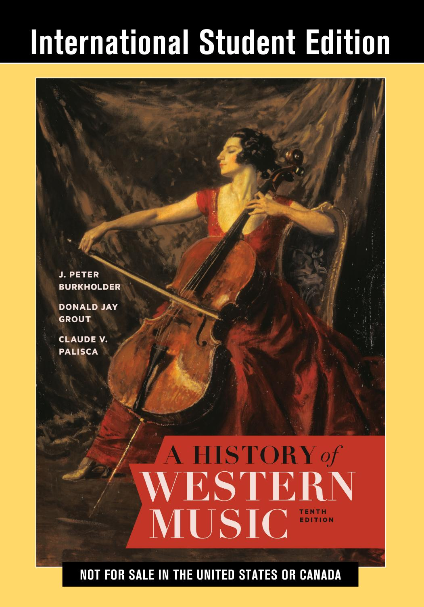

# 西方音樂史 · A History of Western Music
### 第十版 · 講義投影片 PDF Collection · 10th Edition Lecture Slides

  

---

## 關於本專案 · About This Project

**中文：**
本專案為 Burkholder、Grout、Palisca 合著《**A History of Western Music**, Tenth Edition》的完整配套講義投影片，涵蓋**古代至二十一世紀** 39 章，共 **919 張** 16:9 寬螢幕投影片，全部以 PDF 格式提供，方便閱讀、列印與教學使用。

**English:**
This repository provides a complete set of lecture slides for **A History of Western Music**, 10th Edition by Burkholder, Grout, and Palisca. It covers **Antiquity through the Twenty-First Century** in 39 chapters, totaling **919 widescreen (16:9) slides**, all delivered as PDFs for easy reading, printing, and classroom use.

---

## 投影片特色 · Slide Features

| 特色 Feature | 說明 Description |
|---|---|
| 🌐 **中英雙語 Bilingual** | 每頁術語、敘述與聆賞要點同時提供繁體中文與英文 · Every term, narrative, and listening note appears in both Traditional Chinese and English |
| 🎨 **章節專屬配色 Per-chapter color theme** | 各章配色呼應時代氛圍（古代赭紅、哥德靛藍、巴洛克金棕、啟蒙鼠尾草綠等） · Each chapter has its own palette matching the period |
| 🎵 **NAWM 聆賞連結 NAWM listening links** | 每首 Norton Anthology 曲目附直接可點擊的 YouTube 連結（均經驗證可用） · Every Norton Anthology piece includes a verified YouTube link |
| 📐 **16:9 寬螢幕 Widescreen** | 適用現代投影機、電視、平板與筆電 · Ready for modern projectors, TVs, tablets, and laptops |
| ⏱ **章節時間軸 Per-chapter Timeline** | 每章附獨立時間軸投影片，列出該時代雙語關鍵事件年表 · Every chapter includes a dedicated bilingual timeline slide charting key events of the period |
| 📄 **純 PDF 格式 Pure PDF** | 無需安裝 PowerPoint、字型、程式，下載即讀 · No PowerPoint, fonts, or software required — just download and read |
| 📝 **重要術語 Key Terms** | 每章末附雙語詞彙表格，整理該章核心術語與定義 · Every chapter closes with a bilingual glossary grid of core terms and definitions |
| 🗂️ **期末總複習 Condensed Review** | 獨立 100 頁濃縮複習，涵蓋全書 9 大歷史時期，含作曲家、體裁、術語、NAWM 聆賞與考試重點 · A standalone 100-slide review spanning all 9 historical periods, covering composers, genres, terms, NAWM listening, and exam highlights |
| 🖼️ **A3 海報 Cheat Sheet** | 一頁融會貫通的 A3 橫式海報：時間軸 + 6 條國籍作曲家生平、9 時期色帶、體裁演進、9 張時期風格卡，可列印掛牆 · One-page A3 landscape poster synthesizing the entire book: timeline with 6 color-coded composer tracks, 9 era bands, genre evolution, and 9 period summary cards — printable for wall reference |
| ❓ **A3 百大 Q&A 海報** | 一頁 A3 橫式百題問答：9 時期 × 11–12 題（申論／名詞／短答三型混搭），每題附精確 Burkholder 10e 書頁頁碼（如 pp. 192–203） · One-page A3 landscape Q&A sheet: 100 questions across 9 periods (mixed essay / term / short-answer), each with exact Burkholder 10e page references |
| 🔗 **A3 傳承關係圖 Lineage Map** | 一頁 A3 橫式海報：~110 位關鍵作曲家師徒傳承、風格影響、跨期影響、敵對論爭與夫妻／愛慕關係，以時間軸 × 六國籍軌道視覺化呈現 · One-page A3 landscape poster: ~110 key composers with teacher-student chains, stylistic influence, cross-era influence, rivalries, and romantic relationships, visualized on a 900–2025 timeline × 6 nationality tracks |

---

## 章節列表 · Chapter Index

| # | 中文標題 Title (ZH) | 英文標題 Title (EN) | 頁數 Slides | 下載 Download |
|---:|---|---|---:|---|
| 1  | 古代音樂 | Music in Antiquity | 14 | [`Ch01_Music_in_Antiquity.pdf`](Ch01_Music_in_Antiquity.pdf) |
| 2  | 基督教會 | The Christian Church | 14 | [`Ch02_Christian_Church.pdf`](Ch02_Christian_Church.pdf) |
| 3  | 羅馬禮儀 | Roman Liturgy | 14 | [`Ch03_Roman_Liturgy.pdf`](Ch03_Roman_Liturgy.pdf) |
| 4  | 歌謠與舞蹈 | Song and Dance | 14 | [`Ch04_Song_and_Dance.pdf`](Ch04_Song_and_Dance.pdf) |
| 5  | 複音音樂 | Polyphony | 14 | [`Ch05_Polyphony.pdf`](Ch05_Polyphony.pdf) |
| 6  | 十四世紀 | The Fourteenth Century | 28 | [`Ch06_Fourteenth_Century.pdf`](Ch06_Fourteenth_Century.pdf) |
| 7  | 文藝復興 | The Renaissance | 28 | [`Ch07_Renaissance.pdf`](Ch07_Renaissance.pdf) |
| 8  | 英格蘭與勃艮第 | England and Burgundy | 28 | [`Ch08_England_Burgundy.pdf`](Ch08_England_Burgundy.pdf) |
| 9  | 法蘭德斯作曲家 | Franco-Flemish Composers | 28 | [`Ch09_Franco_Flemish.pdf`](Ch09_Franco_Flemish.pdf) |
| 10 | 牧歌 | The Madrigal | 29 | [`Ch10_Madrigal.pdf`](Ch10_Madrigal.pdf) |
| 11 | 宗教改革 | The Reformation | 28 | [`Ch11_Reformation.pdf`](Ch11_Reformation.pdf) |
| 12 | 器樂音樂 | Instrumental Music | 28 | [`Ch12_Instrumental.pdf`](Ch12_Instrumental.pdf) |
| 13 | 十七世紀新風格 | New Styles in the 17th Century | 28 | [`Ch13_New_Styles.pdf`](Ch13_New_Styles.pdf) |
| 14 | 歌劇 | Opera | 28 | [`Ch14_Opera.pdf`](Ch14_Opera.pdf) |
| 15 | 室內樂與教會音樂 | Chamber and Church Music | 28 | [`Ch15_Chamber_Church.pdf`](Ch15_Chamber_Church.pdf) |
| 16 | 法、英、西、新世界、俄 | France, England, Spain, the New World, and Russia | 28 | [`Ch16_France_England.pdf`](Ch16_France_England.pdf) |
| 17 | 十七世紀晚期義大利與德意志 | Italy and Germany in the Late 17th Century | 29 | [`Ch17_Italy_Germany.pdf`](Ch17_Italy_Germany.pdf) |
| 18 | 十八世紀初 | The Early Eighteenth Century | 16 | [`Ch18_Early_Eighteenth.pdf`](Ch18_Early_Eighteenth.pdf) |
| 19 | 德意志晚期巴洛克作曲家 | German Composers of the Late Baroque | 16 | [`Ch19_German_Composers.pdf`](Ch19_German_Composers.pdf) |
| 20 | 啟蒙時代音樂品味與風格 | Musical Taste and Style in the Enlightenment | 14 | [`Ch20_Enlightenment.pdf`](Ch20_Enlightenment.pdf) |
| 21 | 早期古典時期的歌劇與聲樂 | Opera and Vocal Music in the Early Classic Period | 14 | [`Ch21_Early_Classic_Opera.pdf`](Ch21_Early_Classic_Opera.pdf) |
| 22 | 器樂音樂：奏鳴曲、交響曲、協奏曲 | Instrumental Music: Sonata, Symphony, and Concerto | 14 | [`Ch22_Instrumental_Classic.pdf`](Ch22_Instrumental_Classic.pdf) |
| 23 | 古典晚期：海頓與莫札特 | Classic Music in the Late Eighteenth Century | 14 | [`Ch23_Classic_Late_18C.pdf`](Ch23_Classic_Late_18C.pdf) |
| 24 | 革命與變革：貝多芬 | Revolution and Change (Beethoven) | 14 | [`Ch24_Beethoven.pdf`](Ch24_Beethoven.pdf) |
| 25 | 浪漫世代：藝術歌曲與鋼琴音樂 | The Romantic Generation: Song and Piano Music | 14 | [`Ch25_Romantic_Generation.pdf`](Ch25_Romantic_Generation.pdf) |
| 26 | 古典曲式中的浪漫主義：合唱、室內、管弦 | Romanticism in Classical Forms: Choral, Chamber, and Orchestral Music | 28 | [`Ch26_Romantic_Classical.pdf`](Ch26_Romantic_Classical.pdf) |
| 27 | 浪漫歌劇與音樂劇至世紀中葉 | Romantic Opera and Musical Theater to Midcentury | 28 | [`Ch27_Romantic_Opera.pdf`](Ch27_Romantic_Opera.pdf) |
| 28 | 十九世紀後期歌劇與音樂劇 | Opera and Musical Theater in the Later 19th Century | 28 | [`Ch28_Late_19C_Opera.pdf`](Ch28_Late_19C_Opera.pdf) |
| 29 | 德意志晚期浪漫音樂文化 | Late Romanticism in German Musical Culture | 28 | [`Ch29_Late_Romantic_German.pdf`](Ch29_Late_Romantic_German.pdf) |
| 30 | 分歧傳統：十九世紀後期 | Diverging Traditions in the Later Nineteenth Century | 28 | [`Ch30_Diverging_Traditions.pdf`](Ch30_Diverging_Traditions.pdf) |
| 31 | 二十世紀初：俗樂 | The Early Twentieth Century: Vernacular Music | 28 | [`Ch31_Vernacular_Music.pdf`](Ch31_Vernacular_Music.pdf) |
| 32 | 二十世紀初：古典傳統 | The Classical Tradition in the Early Twentieth Century | 36 | [`Ch32_Classical_Tradition.pdf`](Ch32_Classical_Tradition.pdf) |
| 33 | 激進現代主義者 | Radical Modernists | 28 | [`Ch33_Radical_Modernists.pdf`](Ch33_Radical_Modernists.pdf) |
| 34 | 大戰之間：爵士與流行音樂 | Between the World Wars: Jazz and Popular Music | 27 | [`Ch34_Jazz_Popular.pdf`](Ch34_Jazz_Popular.pdf) |
| 35 | 大戰之間：古典傳統 | Between the World Wars: The Classical Tradition | 27 | [`Ch35_Between_Wars_Classical.pdf`](Ch35_Between_Wars_Classical.pdf) |
| 36 | 戰後交流潮流 | Postwar Crosscurrents | 25 | [`Ch36_Postwar_Crosscurrents.pdf`](Ch36_Postwar_Crosscurrents.pdf) |
| 37 | 戰後古典傳統繼承者 | Postwar Heirs to the Classical Tradition | 30 | [`Ch37_Postwar_Heirs.pdf`](Ch37_Postwar_Heirs.pdf) |
| 38 | 二十世紀晚期 | The Late Twentieth Century | 29 | [`Ch38_Late_Twentieth.pdf`](Ch38_Late_Twentieth.pdf) |
| 39 | 二十一世紀 | The Twenty-First Century | 25 | [`Ch39_Twenty_First_Century.pdf`](Ch39_Twenty_First_Century.pdf) |
| | | **總計 Total** | **919** | |
| ★  | 期末總複習 | Condensed Review (9 Periods) | 100 | [`Condensed_Review.pdf`](Condensed_Review.pdf) |
| 🖼️ | A3 海報 | A3 Cheat Sheet (Landscape Poster) | 1 | [`Cheat_Sheet.pdf`](Cheat_Sheet.pdf) |
| ❓ | A3 百大 Q&A | A3 Top 100 Q&A (Landscape, with page refs) | 1 | [`QA_100.pdf`](QA_100.pdf) |
| 🔗 | A3 傳承關係圖 | A3 Lineage Map (Composer Relationships) | 1 | [`Lineage_Map.pdf`](Lineage_Map.pdf) |

---

## 使用方式 · How to Use

**中文：** 直接點擊上表中任一 PDF 連結即可下載或於瀏覽器中開啟閱讀。所有投影片皆為靜態 PDF，不需額外軟體。

**English:** Click any PDF link in the table above to download or open it directly in your browser. All slides are static PDFs — no additional software required.

---

## 授權與引用 · License & Citation

**中文：** 本投影片內容依據原書章節整理，僅供學術研究與教學參考。原書著作權屬於 W. W. Norton & Company 及原作者群 (Burkholder, Grout, Palisca) 所有。

**English:** These slides summarize chapters of the original textbook for academic and teaching reference only. Copyright of the source material belongs to W. W. Norton & Company and the authors (Burkholder, Grout, Palisca).

> Burkholder, J. Peter, Donald Jay Grout, and Claude V. Palisca.
> *A History of Western Music*, 10th ed. New York: W. W. Norton, 2019.
